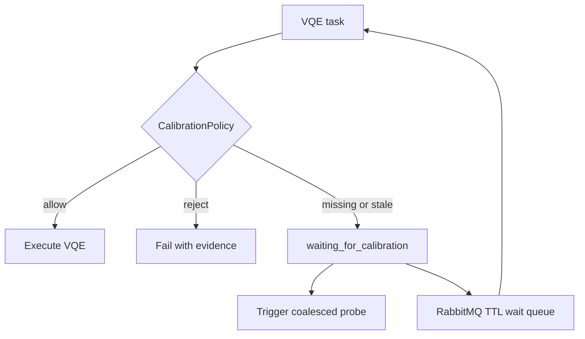

# Calibration-aware experiment execution

## Scope

VQE is expensive and repeatedly exercises the backend. Before starting it, the
orchestrator now requires a recent, acceptable Bell Z-parity verification
observation. Grover, SAT-Grover and QPE bypass this gate so they remain useful
as fast diagnostics.

The gate does not claim that the backend is fully calibrated or that VQE will
be accurate. `docs/architecture/calibration.md` defines the narrower evidence
provided by the current probe.

## State and policy

Alembic migration `0004` creates `backend_calibration_state`, a materialized
PostgreSQL snapshot containing the latest observation for each backend. Kafka
and TimescaleDB remain the historical telemetry path; this small transactional
snapshot exists for low-latency execution decisions.

The pure `CalibrationPolicy` returns:

- `ALLOW` for a fresh observation below the rejection threshold;
- `WAIT_FOR_CALIBRATION` for a missing or stale observation;
- `REJECT` for a fresh observation at or above the rejection threshold.

Defaults are a 600-second freshness interval and a 0.10 Bell-parity error
rejection threshold. They can be changed with
`CALIBRATION_FRESHNESS_S` and `CALIBRATION_REJECT_ERROR_RATE`.

## Non-blocking waiting



The worker does not sleep while a VQE task waits. It publishes the task to
`experiments.waiting-for-calibration` with a per-message expiration. RabbitMQ
dead-letters the expired message back to `experiments`, releasing the worker in
the meantime. `CALIBRATION_WAIT_DELAY_S` defaults to 5 seconds and
`CALIBRATION_MAX_WAIT_ATTEMPTS` defaults to 12.

An `asyncio.Event` triggers the background probe immediately. Event semantics
coalesce multiple requests: twenty waiting VQE jobs set the same event rather
than launching twenty simultaneous calibration circuits.

The API persists `waiting_for_calibration` as a non-terminal experiment status,
and the dashboard renders it separately from `queued`, `completed`, and
`failed`.

## Demo and validation

With the normal stack running:

```bash
python3 scripts/validate_calibration_gate.py
```

The validator makes the current snapshot stale, submits a one-iteration H2
VQE, observes `waiting_for_calibration`, and verifies that the triggered probe
refreshes the snapshot and allows execution to resume.

For a deterministic rejection demonstration, restart the stack with an
explicit synthetic probe error:

```bash
CALIBRATION_DEMO_ERROR_RATE=0.20 ./dev.sh
```

This hook moves simulated even-parity counts to odd parity after execution. It
is explicitly not a physical Aer noise model and is disabled by default. Its
purpose is to exercise the real persistence, policy, API, and dashboard paths
deterministically. Remove the environment variable and restart to return to
normal noiseless Aer behavior.

## Airflow boundary

Airflow is not part of the online decision path. A future optional DAG can run
a larger scheduled probe suite and update the same materialized snapshot. The
orchestrator will continue to make a fast local policy decision even if the
Airflow control plane is unavailable.
