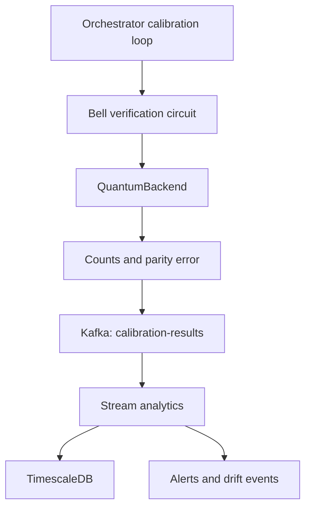
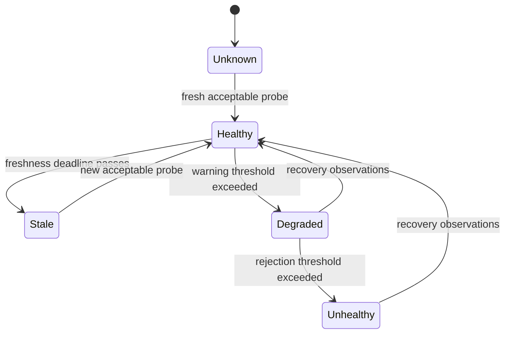

# Backend calibration and verification

## Purpose

The platform periodically runs a known quantum circuit and publishes an
`error_rate` observation. This document defines what that observation means,
what it does and does not establish, and how it may eventually be used to gate
expensive experiment execution.

The terminology requires care: the current implementation does not calibrate
or tune the backend. It performs a **backend verification probe** whose result
becomes one input to a derived backend-health decision.

## Calibration on a physical QPU

Physical qubits and their control electronics drift. Calibration on a real QPU
usually includes characterization and adjustment of quantities such as:

- qubit transition frequencies;
- microwave pulse amplitude, duration, and phase;
- single- and two-qubit gate fidelity;
- measurement-discrimination thresholds and readout error;
- relaxation time, \(T_1\);
- coherence or dephasing time, \(T_2\) or \(T_2^*\);
- coupling and crosstalk between qubits.

For example, calibrating an \(X\) gate may involve finding the pulse amplitude
that produces a \(\pi\)-rotation:

$$
|0\rangle \xrightarrow{R_x(\pi)} |1\rangle.
$$

The calibration procedure may update physical control parameters. Providers
also expose calibration properties so that transpilers and schedulers can
select qubits and mappings with suitable fidelity.

## What this project currently implements

The orchestrator starts `run_calibration_loop()` as a background task. By
default, it executes once every 300 seconds. Each cycle submits a two-qubit
Bell-state circuit through the same `QuantumBackend` and polling abstraction
used by normal experiments:

$$
|00\rangle
\xrightarrow{H\otimes I}
\frac{|00\rangle+|10\rangle}{\sqrt{2}}
\xrightarrow{\operatorname{CNOT}}
\frac{|00\rangle+|11\rangle}{\sqrt{2}}.
$$

The circuit is measured in the computational basis. Ideally:

$$
P(00)=\frac{1}{2},\qquad
P(11)=\frac{1}{2},\qquad
P(01)=P(10)=0.
$$

The implementation defines the observed error rate as:

$$
\text{error rate}=
\frac{N_{01}+N_{10}}
     {N_{00}+N_{01}+N_{10}+N_{11}},
$$

where \(N_x\) is the number of shots measured as bit string \(x\).

For example, given:

```json
{
  "00": 490,
  "11": 500,
  "01": 20,
  "10": 14
}
```

the error rate is:

$$
\frac{20+14}{1024}\approx 0.0332.
$$

Approximately 3.32% of the shots violated the expected Bell-state parity.

## What a successful probe establishes

A successful cycle provides evidence that:

- the backend is reachable and accepts a circuit;
- job submission and status polling work;
- the job completes within the configured timeout;
- result retrieval and measurement decoding work;
- the selected single-qubit, two-qubit, and measurement operations produce an
  acceptable Bell-parity error for the two qubits used by the probe.

This makes the current mechanism useful as an integration health check and a
narrow quality observation. It is not evidence that the complete device has
been calibrated.

## What the probe does not establish

The current metric cannot reliably determine:

- whether an error came from the Hadamard gate, CNOT, or readout;
- error rates for qubits not used by the probe;
- individual \(T_1\), \(T_2\), or \(T_2^*\) values;
- coherent gate over-rotation;
- topology-dependent errors and crosstalk;
- whether another physical-qubit mapping would be better;
- accuracy of deeper or wider circuits such as molecular VQE circuits;
- whether the backend satisfies a provider's complete calibration procedure.

The measurement is also insensitive to some phase errors. For example:

$$
\frac{|00\rangle+|11\rangle}{\sqrt{2}}
\longrightarrow
\frac{|00\rangle-|11\rangle}{\sqrt{2}}
$$

changes the relative phase but produces the same `00`/`11` distribution in
the computational basis. The current error-rate calculation can therefore be
zero even though the state differs from the intended Bell state.

Likewise, the metric does not penalize a large imbalance between `00` and
`11`, provided both retain even parity. Such an imbalance may still contain
useful diagnostic information.

## Simulator limitation

`AerBackend` is currently configured as a noiseless simulator. Consequently,
the Bell-parity error is normally approximately zero and does not exhibit
physical drift.

In the current environment, the probe primarily verifies that the software
path is operational. A meaningful quality or drift demonstration requires an
explicit Aer noise model, a mock backend with controlled degradation, or a
real QPU backend.

## Runtime and telemetry flow



The main components are:

- `services/orchestrator/app/tasks/calibration.py` builds and runs the circuit;
- `QuantumBackend` and `wait_for_result()` provide the normal asynchronous job
  lifecycle;
- Kafka topic `calibration-results` carries observations;
- `stream-analytics` calculates rolling/windowed metrics and alert state;
- TimescaleDB stores the observation history;
- Grafana visualizes the resulting time series.

A calibration observation currently contains:

| Field | Meaning |
|---|---|
| `timestamp` | Completion time of the probe |
| `backend_name` | Backend that executed the circuit |
| `shots` | Number of measurement repetitions |
| `counts` | Raw measurement histogram |
| `error_rate` | Fraction of `01` and `10` outcomes |

## Terminology and domain model

The following terminology is recommended for future code:

- **`BackendVerificationProbe`** — a known experiment used to observe one
  aspect of backend behavior;
- **`CalibrationObservation`** — the immutable result of one probe execution;
- **`BackendHealthState`** — a derived state based on observation freshness,
  quality, and availability;
- **`CalibrationPolicy`** — the policy that decides whether an experiment may
  execute, must wait, or must be rejected.

The existing `calibration-results` topic can retain its name. Renaming a public
topic is unnecessary if its narrower semantics are explicitly documented.

## Contract for execution gating

The future execution gate must not interpret a low Bell-parity error as proof
that every circuit will execute accurately. Its initial contract should remain
narrow:

| Decision input | What it establishes |
|---|---|
| Probe completed | Backend was reachable at the observation time |
| Observation is recent | Health evidence is not older than the freshness policy |
| Error rate is acceptable | Bell parity was within the configured policy |
| Complete QPU calibration | Not established by the current probe |
| VQE accuracy | Not established by the current probe |

A possible policy result is:

```text
ALLOW
  latest observation exists
  AND observation is fresh
  AND Bell-parity error is within policy

WAIT_FOR_CALIBRATION
  observation is missing or stale

REJECT
  repeated probes fail
  OR recent error rate exceeds the rejection threshold
```

The corresponding derived states could be:



Thresholds, freshness intervals, and recovery requirements belong in policy
configuration rather than being hard-coded into the orchestrator.

## Recommended verification suite

The Bell-parity circuit can remain one probe in a broader suite:

1. **Computational-basis readout** — verify `|0>` and `X|0>` measurements.
2. **Hadamard balance** — verify that `H|0>` produces approximately equal `0`
   and `1` counts.
3. **Bell correlation in the Z basis** — the current parity probe.
4. **Bell correlation in the X basis** — expose phase errors that the current
   measurement cannot see.
5. **Relaxation experiment** — estimate \(T_1\).
6. **Ramsey experiment** — estimate \(T_2^*\).
7. **Randomized benchmarking or mirror circuits** — estimate aggregate gate
   quality.
8. **Reference workload** — run a small problem with a known acceptable result,
   such as a compact H2 VQE configuration.

Each observation should identify its probe type, qubits, backend, timestamp,
shot count, metric definitions, and software/backend version. Health policy can
then make decisions from explicit evidence rather than one overloaded
`error_rate` value.

## Airflow boundary

Airflow or another DAG engine can be useful for scheduled, offline calibration
workflows:

- run a suite of characterization experiments;
- aggregate and compare results with historical baselines;
- update a materialized backend-health snapshot;
- notify operators or disable an unhealthy backend;
- periodically backfill or recompute derived metrics.

It should not sit in the low-latency path of every queued experiment. The
orchestrator should read a compact, materialized health state and make a fast
policy decision. This separates scheduled calibration workflows from online
execution control.
