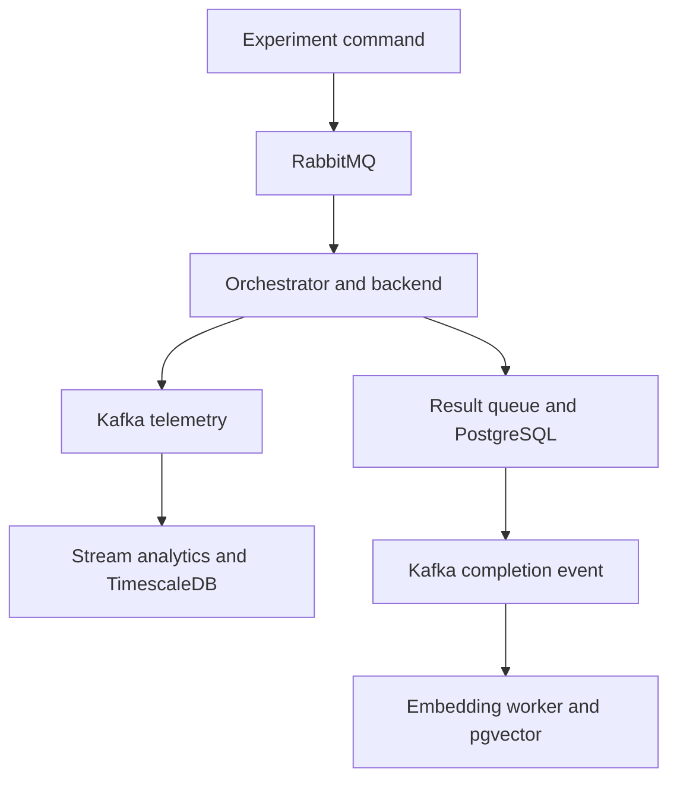

# Quantum Platform developer guide

This guide is a maintenance map for returning to the repository after several
months. Start with the ownership tables, then use the change recipes rather
than searching the entire repository.

## 1. Mental model

The platform has three different flows that should not be conflated:



- **Command flow:** API → RabbitMQ → orchestrator → result queue → API.
- **Telemetry flow:** orchestrator → Kafka → analytics → TimescaleDB/Grafana.
- **Semantic-index flow:** completed API record → Kafka → result indexer →
  PostgreSQL/pgvector.

RabbitMQ answers “perform this work once.” Kafka answers “retain and replay
these observations.” PostgreSQL stores current experiment state. TimescaleDB
stores append-only time-series observations.

## 2. Service ownership map

| Component | Responsibility | Entry point |
|---|---|---|
| `services/api` | validation, experiment persistence, RabbitMQ publishing, result consumption, HTTP/dashboard | `app/main.py` |
| `services/orchestrator` | task consumption, calibration gate, algorithm dispatch, result and telemetry publishing | `app/worker.py` |
| `services/quantum-core` | framework-independent algorithms, molecules, backend abstraction, polling, VQE loop | `quantum_core/` |
| `services/stream-analytics` | Kafka consumption, TimescaleDB sinks, rolling/Faust aggregation, alerts and drift | `app/consumer.py`, `app/faust_app.py` |
| `services/result-indexer` | canonical result text, local embeddings, pgvector upsert | `app/worker.py` |
| `services/telemetry-ingest` | standalone/skeleton telemetry producer and schemas; not started by `dev.sh` | `app/producer.py` |
| `services/fast-control` | placeholder for a future low-latency service; not part of the active runtime | — |
| `infra/` | RabbitMQ, Prometheus, Grafana configuration | `docker-compose.yml` |
| `scripts/` | load generation and end-to-end validators | `run_observe.sh` and `validate_*.py` |

## 3. Startup ownership

`dev.sh` is the local composition root. It:

1. starts Docker Compose services;
2. waits for RabbitMQ, PostgreSQL, Kafka, and TimescaleDB;
3. creates/updates per-service virtual environments;
4. optionally runs tests under `--profile=verify`;
5. runs API Alembic migrations;
6. starts API, orchestrator, plain stream consumer, and result indexer;
7. tails their logs.

It does not start `app.faust_app`; run that separately when windowed Faust
processing is required.

When adding a new continuously running service, update:

- its own `requirements.txt` and tests;
- `dev.sh` setup, verification, start, cleanup text, and log tail;
- `docker-compose.yml` only if it runs in Docker or needs infrastructure;
- `README.md`/`docs/setup.md` and the demo guide.

## 4. Contracts and topics

### RabbitMQ

| Queue | Producer | Consumer | Contract |
|---|---|---|---|
| `experiments` | API | orchestrator | `ExperimentTask` in `quantum_core/tasks.py` |
| `experiment-results` | orchestrator | API | `ExperimentResultMessage` |
| `experiments.waiting-for-calibration` | orchestrator | RabbitMQ TTL/DLX back to `experiments` | original task plus wait-count header |
| `experiments.dlq` | retry policy | operator/manual tooling | exhausted or malformed task |

### Kafka

| Topic | Producer | Consumer |
|---|---|---|
| `calibration-results` | orchestrator calibration task | plain consumer and Faust |
| `calibration-alerts` | Faust | external/notifier demo |
| `calibration-drift-alerts` | Faust | external/notifier demo |
| `vqe-iteration-metrics` | orchestrator VQE publisher | plain consumer and Faust |
| `vqe-window-metrics` | Faust | plain consumer/TimescaleDB |
| `experiment-completed` | API result consumer | result indexer |

Whenever an event schema changes, search the topic name and update every
producer, typed Faust record, consumer, sink, test, and documentation entry.

## 5. Storage map

| Store | Data | Schema owner |
|---|---|---|
| PostgreSQL `experiments` | current request/status/result | API Alembic migrations |
| PostgreSQL `experiment_embeddings` | canonical text and pgvector embedding | API migration `0003` |
| PostgreSQL `backend_calibration_state` | latest materialized probe per backend | API migration `0004` |
| TimescaleDB `calibration_events` | calibration history | `stream-analytics/init/001_*.sql` |
| TimescaleDB `vqe_iteration_metrics` | raw VQE iterations | `init/002_*.sql` |
| TimescaleDB `vqe_window_metrics` | Faust-derived windows | `init/003_*.sql` |
| Kafka | replayable telemetry/event log | producer/consumer contracts |

Use Alembic for evolving transactional PostgreSQL state. TimescaleDB currently
uses Docker initialization SQL. Those SQL files run automatically only against
an empty volume; existing installations need a manual migration or explicit
volume recreation.

## 6. Recipe: add a new raw VQE iteration metric

Example: add `queue_time_s` or `circuits_submitted`.

1. **Collect it at the lowest truthful layer.**
   - Backend polling measurement: update `quantum_core/sync/polling.py` and
     `PollingMetrics`.
   - Per-term/per-iteration accumulation: update
     `quantum_core/loops/vqe_loop.py`, especially `VQEIterationMetrics` and
     `VQEIterationLog`.
2. **Ensure it reaches `VQEResult.history`.**
   - `quantum_core/execution.py::run_vqe_sync()` serializes history with
     `asdict()`.
3. **Extend the Kafka source event.**
   - Add the field to
     `orchestrator/app/tasks/vqe_metrics.py::VQEIterationMetricsMessage`.
   - Map the history field in `publish_vqe_history()`.
4. **Extend the Faust input record.**
   - Add the field to `stream-analytics/app/faust_app.py::VQEIterationMetricsEvent`.
5. **If it participates in windows:**
   - add sufficient state to `VQEWindowState`;
   - update `process_vqe_iteration()`;
   - add the derived field to `VQEWindowMetricsEvent`.
6. **Persist it.**
   - alter `stream-analytics/init/002_create_vqe_metrics_hypertable.sql` for
     raw data;
   - alter `003_create_vqe_window_metrics_hypertable.sql` for window data;
   - update SQL and parameter binding in `app/sinks/timescale_sink.py`;
   - update dispatch/logging in `app/consumer.py`.
7. **Visualize it.**
   - edit `infra/grafana/provisioning/dashboards/vqe-overview.json` or
     `vqe-window-overview.json`;
   - document its unit and interpretation in `docs/architecture/vqe-metrics.md`
     and the Grafana interpretation guide.
8. **Test it.**
   - quantum-core accumulation tests;
   - orchestrator message serialization test if added;
   - `stream-analytics/tests/test_timescale_sink.py`;
   - Faust aggregation tests for new window arithmetic.

Do not call total backend wait “physical QPU execution time” unless the backend
actually separates queued, running, and retrieval phases.

## 7. Recipe: add a new VQE window metric only

If the source fields already exist and only a new aggregate is needed—for
example maximum retry count per window—start in Faust:

1. add state to `VQEWindowState`;
2. update it in `process_vqe_iteration()`;
3. expose it on `VQEWindowMetricsEvent`;
4. extend `vqe_window_metrics` SQL schema;
5. extend `insert_vqe_window_metric()`;
6. update the window branch in `consumer.py`;
7. update the Grafana window dashboard;
8. add aggregation and sink tests.

The window is a 60-second tumbling window keyed by `experiment_id`. Preserve
that keying unless the metric explicitly requires a different aggregation
dimension.

## 8. Recipe: add a RabbitMQ orchestration metric

First decide whether the metric belongs to the broker or the application.

### Broker metric

Queue depth, publish/delivery rates, consumers, acknowledgements, and memory
already come from RabbitMQ's Prometheus plugin.

Change locations:

- plugin enablement: `infra/rabbitmq/enabled_plugins`;
- per-object export settings: `infra/rabbitmq/rabbitmq.conf`;
- scrape target/path: `infra/prometheus/prometheus.yml`;
- visualization: `infra/grafana/provisioning/dashboards/rabbitmq-overview.json`.

Usually no Python change is required. Confirm the metric name in Prometheus
before adding a Grafana panel.

### Application lifecycle metric

Examples: time spent waiting for calibration, task execution duration by
algorithm, retry outcome, or DLQ reason. RabbitMQ cannot infer these.

The current orchestrator does not expose an application `/metrics` endpoint.
A clean implementation should:

1. add `prometheus-client` to `services/orchestrator/requirements.txt`;
2. define metrics in a dedicated `app/metrics.py`, not inline globals across
   handlers;
3. instrument `worker.py::handle_message()`, `calibration_wait.py`, or
   `retry_policy.py` at the actual state transition;
4. start a Prometheus HTTP endpoint once from `worker.py::main()`;
5. add an orchestrator scrape job in `infra/prometheus/prometheus.yml`;
6. add panels to the RabbitMQ/operations dashboard or a new orchestrator
   dashboard;
7. test label values and counter/timer transitions with fakes.

Keep labels bounded. `algorithm` and outcome are safe; `experiment_id` is not
a safe Prometheus label because it creates unbounded cardinality.

If the requirement is replayable per-experiment analysis rather than aggregate
operations monitoring, publish a Kafka event instead of a Prometheus metric.

## 9. Recipe: change RabbitMQ retry behavior

- worker-crash retry and DLQ: `orchestrator/app/retry_policy.py`;
- calibration waiting queue and headers: `app/calibration_wait.py`;
- decision and acknowledgement points: `app/worker.py`;
- queue names/message envelopes: `quantum_core/tasks.py`;
- broker inspection/dashboard: RabbitMQ UI and
  `infra/grafana/.../rabbitmq-overview.json`.

Preserve the rule that a new message is published successfully before the
original is acknowledged. Otherwise a crash can lose work.

Backend polling retry is a separate concern and lives in
`quantum_core/sync/polling.py`.

## 10. Recipe: change calibration or its gate

| Concern | File |
|---|---|
| Bell circuit and error equation | `orchestrator/app/tasks/calibration.py` |
| Periodic/immediate loop | same file, `run_calibration_loop()` |
| Latest-state persistence | `app/calibration_store.py` |
| Pure allow/wait/reject decision | `app/calibration_policy.py` |
| TTL rescheduling | `app/calibration_wait.py` |
| Gate application to VQE | `app/worker.py::handle_message()` |
| Waiting status persistence | `api/app/main.py::apply_result_message()` |
| Calibration HTTP endpoint | `api/app/routers/backends.py` |
| Transactional schema | API migration `0004` |
| Historical telemetry | `stream-analytics/app/consumer.py` and Timescale sink |
| Alert/drift logic | `faust_app.py`, `alerting.py`, `drift.py` |

When adding a new probe type, record its identity, qubits, metric definition,
and timestamp. Do not combine unrelated measurements into the existing
`error_rate` without changing the schema and policy contract.

Update `docs/architecture/calibration.md` and
`calibration-aware-execution.md` whenever the evidence or policy semantics
change.

## 11. Recipe: add a molecule

1. add the name to `chemistry/molecules.py::MoleculeName`;
2. add fixed data or a reproducible generator configuration;
3. return a validated `MolecularHamiltonian` with geometry, mapping, Pauli
   terms, energy offsets, initial state, reference energy, and provenance;
4. update `get_molecule()` and cache behavior if needed;
5. add the API literal in `api/app/schemas/experiments.py::VQERequest`;
6. update `scripts/observe.py` CLI choices and payload generation;
7. add chemistry and molecule tests;
8. add `docs/chemistry/<name>_hamiltonian.md` with reproducibility details;
9. test statevector/reference energy before trusting shot-based VQE.

The ansatz is separate from molecule data. If qubit count alone is no longer
sufficient, change the ansatz strategy in `quantum_core/algorithms/vqe.py`
instead of putting circuit behavior into molecule definitions.

## 12. Recipe: add a new algorithm

1. implement circuit/problem logic in `quantum_core/algorithms/`;
2. add a framework-independent execution function in `quantum_core/execution.py`;
3. add an API Pydantic request model and discriminated-union member in
   `api/app/schemas/experiments.py`;
4. add dispatch in `orchestrator/app/tasks/run_experiment.py`;
5. update load generation in `scripts/observe.py` if it should participate;
6. extend result canonicalization in `result-indexer/app/canonical.py`;
7. add unit tests at the algorithm, API validation, dispatch, and result levels;
8. document result interpretation and expected units.

Do not import FastAPI, RabbitMQ, or Kafka into `quantum-core`.

## 13. Recipe: change experiment API or persistence

- request/response shape: `api/app/schemas/experiments.py`;
- HTTP behavior: `api/app/routers/experiments.py`;
- RabbitMQ connection/publishing: `api/app/deps.py`;
- result consumption and status transitions: `api/app/main.py`;
- storage contract: `api/app/store/base.py`;
- in-memory test implementation: `store/in_memory.py`;
- PostgreSQL implementation/model: `store/postgres.py`, `store/models.py`;
- schema evolution: `api/migrations/versions/`;
- frontend: `api/static/dashboard/index.html`;
- tests: `api/tests/`.

Save the queued row before publishing its task. The result can return very
quickly, and the API consumer must find an existing experiment record.

## 14. Recipe: change semantic search

- completion publication: `api/app/kafka.py` and result consumer in
  `api/app/main.py`;
- algorithm-specific text: `result-indexer/app/canonical.py`;
- embedding model/worker: `result-indexer/app/worker.py`;
- pgvector upsert: `result-indexer/app/repository.py`;
- schema/index dimension: API migration `0003`;
- nearest-neighbour API: `api/app/routers/similarity.py`;
- response schema: `api/app/schemas/similarity.py`;
- validator: `scripts/validate_vector_search.py`.

Changing embedding models requires re-indexing. Never compare vectors from
different models as if they shared one vector space. Keep the model identifier
with every row and coordinate vector dimension changes with a migration.

## 15. Recipe: add a calibration or Kafka-derived alert

For a simple rolling calculation in the plain consumer:

- pure state: `stream-analytics/app/rolling.py` or a new pure module;
- topic dispatch: `app/consumer.py`;
- persistence: `app/sinks/timescale_sink.py` and `init/*.sql`.

For stateful/changelog-backed processing:

- record types, topics, tables, and agents: `app/faust_app.py`;
- pure hysteresis: `app/alerting.py`;
- statistical baseline: `app/drift.py`;
- Faust UI: `static/dashboard/index.html`.

Keep state-machine math in pure modules and let Kafka/Faust code adapt records
to those functions. This makes edge cases testable without a broker.

## 16. Recipe: add or change a Grafana panel

1. identify the correct source: Prometheus for operations, PostgreSQL for
   current experiment state, TimescaleDB for time series;
2. verify the query directly in Prometheus or `psql`;
3. edit the matching JSON under `infra/grafana/provisioning/dashboards/`;
4. confirm the datasource UID in `infra/grafana/provisioning/datasources/`;
5. restart/reload Grafana provisioning;
6. document axes, units, and interpretation.

Avoid presenting `quantum_time_s` as pure physical execution time; it currently
includes backend-facing wait.

## 17. Testing strategy

Fast verification:

```bash
./dev.sh --profile=verify
```

Test ownership:

- quantum backend/polling/molecules: `services/quantum-core/tests/`;
- API routes, validation, stores, status updates: `services/api/tests/`;
- stream arithmetic and sinks: `services/stream-analytics/tests/`;
- embeddings/canonicalization: `services/result-indexer/tests/`;
- calibration policy/store/demo injection: `services/orchestrator/tests/`;
- complete system paths: `scripts/validate_*.py`.

Prefer pure functions and explicit fake pools/messages to broker-heavy unit
tests. Use end-to-end scripts for wiring that only RabbitMQ, Kafka, PostgreSQL,
and TimescaleDB together can prove.

## 18. Debugging by symptom

| Symptom | Start here |
|---|---|
| HTTP 422 | `api/app/schemas/experiments.py`, API response body |
| queued forever | `.dev-logs/orchestrator.log`, RabbitMQ `experiments` queue |
| waiting for calibration | calibration endpoint, `backend_calibration_state`, wait queue |
| VQE completed but no raw metrics | `orchestrator/app/tasks/vqe_metrics.py`, Kafka topic |
| raw metrics but no window metrics | Faust worker and `process_vqe_iteration()` |
| Kafka window events but empty Grafana | plain consumer, Timescale sink/table/query |
| result completed but no vector | API completion publisher, `result-indexer.log` |
| wrong molecular energy | molecule offsets/mapping/initial state and VQE history |
| polling timeout/retries | `quantum_core/sync/polling.py` and backend logs |

## 19. Safe change checklist

Before committing:

1. identify the source-of-truth layer for the change;
2. update every producer/consumer if a message contract changes;
3. add a migration for persistent schema changes;
4. add unit tests for pure logic and an integration validator for wiring;
5. run `./dev.sh --profile=verify`;
6. run the relevant `scripts/validate_*.py` scenario;
7. inspect dashboard units and labels;
8. update architecture and interpretation documentation;
9. check `git diff --check` and `git status`;
10. avoid `./dev.sh --clean` unless data deletion is intentional.

